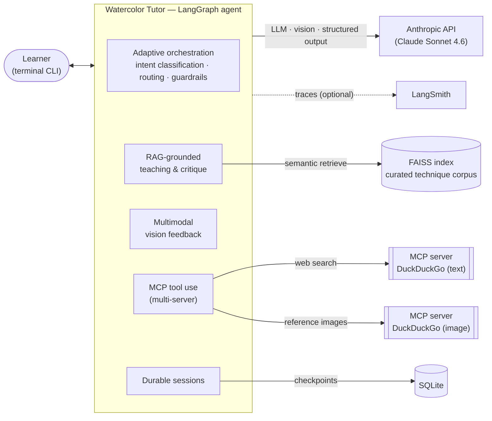
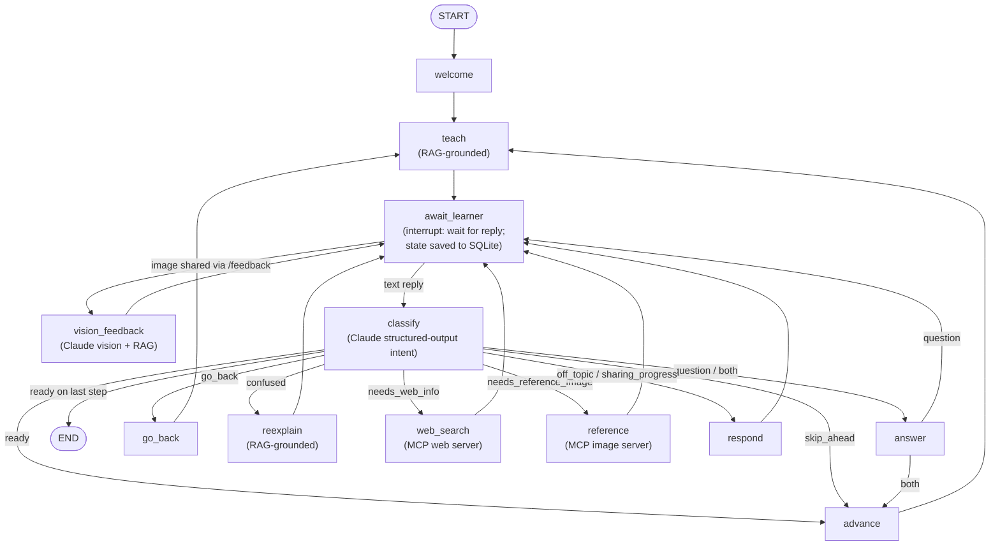

# Watercolor Tutor 🎨

An agentic AI that teaches an absolute beginner to paint their first watercolor, **step by step** — and along the way **sees and critiques their painting**, **grounds its teaching in a curated knowledge base**, **remembers each learner across sessions**, and can **reach the live web**. It runs as a terminal conversation and is built to demonstrate production-grade agentic-AI engineering: LLM orchestration, multimodal input, retrieval-augmented generation, durable state, external tool use over MCP, and full observability.

The lesson itself is a stable three-step spine — **materials → brush control → first flat wash** — and everything else is the agent's intelligence layered on top.

---

## Capabilities (and the engineering each demonstrates)

| Capability | What it does | Engineering concept |
|---|---|---|
| **Adaptive conversational orchestration** | Understands what the learner wants on each turn (a question, "I'm ready", confusion, "go back", off-topic, etc.) and routes accordingly | LLM **intent classification with structured output**, a **LangGraph state machine**, and **navigation guardrails** (you can't skip past the last step or back before the first) |
| **Multimodal vision feedback** | The learner shares a photo of their painting and gets **step-anchored** critique ("is the wash smooth? streaky?"), not generic praise | **Claude vision** (image-before-text content blocks); the critique is also RAG-grounded in the fault rubric |
| **Production RAG** | Teaching *and* critique are grounded in a curated technique corpus (exact ratios, named techniques, fault→cause→fix) | **FAISS** vector store + **sentence-transformers** embeddings, with an **ingestion / query split** (index once, query many) |
| **Durable persistence** | A returning learner resumes exactly where they left off — same step, same conversation — across app restarts | **SQLite checkpointer** keyed by a `thread_id` session id |
| **MCP tool use** | Fetches live info the model/corpus can't cover — current beginner-kit recommendations, prices — and reference example images | **Multi-server MCP client** (web + image search), **intent-gated**, with **graceful fallback** |
| **Observability** | Full traces of every run — node flow, each LLM call with token usage + latency, RAG and tool calls | **LangSmith tracing** (optional, additive) |

---

## Architecture

### System view



### Graph-flow view

The agent is a LangGraph `StateGraph`. `await_learner` pauses the graph (`interrupt()`) and the checkpointer saves state there; the learner's reply resumes it. `classify` runs the LLM intent classifier; pure routers act on the result.



> Guardrails (kept out of the diagram for clarity): a `skip_ahead` on the last step or a `go_back` on the first step is routed to `respond` for a graceful "you're already at the edge" message rather than running off the ends of the lesson — and the move nodes clamp the step number defensively.

---

## How it works

**The teach → paint → critique loop.** The tutor teaches a step (grounded in the corpus), the learner practices, then shares a photo with `/feedback <path>`; the `vision_feedback` node critiques it *anchored to the current step* and grounded in the same fault rubric the teaching uses — so teaching and critique speak from one source of truth.

**The conversation turn.** Each reply flows through one spine:

1. `await_learner` pauses for the learner (and persists state at the pause).
2. If they attached an image → `vision_feedback`; otherwise → `classify`.
3. `classify` labels the intent via structured output (one of ten labels).
4. A pure router maps the intent to a node: answer a question, advance/go back a step, re-explain, redirect, fetch web info, fetch a reference image, or end the lesson.
5. Most nodes loop back to `await_learner`; step changes re-`teach`.

A keyword heuristic stands in if the classifier call ever fails, so routing never hard-crashes.

---

## Setup & run

**Requirements:** Python 3.11+, an [Anthropic API key](https://console.anthropic.com).

```bash
# 1. Install (editable, with dev tooling)
python -m venv .venv && source .venv/bin/activate
pip install -e ".[dev]"

# 2. Configure secrets
cp .env.example .env        # then edit .env and set ANTHROPIC_API_KEY

# 3. Build the RAG index (REQUIRED once before first run; rebuild if the corpus changes)
python -m watercolor_tutor.ingest

# 4. Run the tutor
python -m watercolor_tutor                 # resumes the "default" session
python -m watercolor_tutor --session alice  # a named, separately-resumable session
python -m watercolor_tutor --fresh          # start a brand-new session
```

**During the conversation:** chat naturally; share your painting with `/feedback <path-to-image>`; ask *"can I see an example of a wash?"* for a reference image. Re-running with the same `--session` resumes where you left off.

**Configuration (`.env`):**

| Variable | Required? | Default | Purpose |
|---|---|---|---|
| `ANTHROPIC_API_KEY` | **Yes** | — | Claude (LLM, vision, structured output) |
| `WATERCOLOR_MODEL` | No | `claude-sonnet-4-6` | Model id |
| `WATERCOLOR_DB_PATH` | No | `watercolor_tutor.sqlite` | Session store (delete to reset) |
| `WATERCOLOR_WEB_SEARCH` / `WATERCOLOR_IMAGE_SEARCH` | No | `true` | Kill-switches for the two MCP search tools |
| `LANGSMITH_API_KEY` | No | — | Enables LangSmith tracing if present; the app runs untraced without it |

The web/image **search servers are no-key** (DuckDuckGo MCP servers, installed as dependencies). LangSmith is entirely optional — tracing is additive and never required.

---

## Design decisions worth highlighting

- **Swappable seams.** The backend behind each capability is dependency-injected or config-driven, so it can change without touching the agent's nodes:
  - retrieval is one `retrieve()` function — it moved from in-memory cosine to FAISS + sentence-transformers with **zero node changes**;
  - the checkpointer is injected at compile time (`InMemorySaver` for tests → `SqliteSaver` for the app → `PostgresSaver` is the same interface);
  - the MCP search server is a config value (no-key DuckDuckGo today → a keyed Tavily/Brave is a one-line change).
- **"Additive, never required" observability.** Tracing turns on only when a LangSmith key is present; with no key the app and the entire test suite run identically, with no tracing and no network.
- **Honest scoping.** The corpus is four short documents — it does **not** need FAISS or transformer embeddings. The production RAG architecture (vector store + an offline ingestion/query split) is used **deliberately to demonstrate the scalable shape**, and that intent is documented in the code rather than dressed up as necessity.
- **Copyright-safe references.** Reference search returns **links + descriptions + attribution**, never reproduced artwork.
- **Graceful degradation throughout.** Classifier → keyword fallback; web/image search → returns empty and the agent says so; image search → falls back to text-page links when the image endpoint is rate-limited. External flakiness never crashes the lesson.

---

## Tech stack

- **Orchestration:** [LangGraph](https://github.com/langchain-ai/langgraph) (state machine + `interrupt()` human-in-the-loop + checkpointer)
- **LLM / vision / structured output:** [Anthropic Claude](https://docs.anthropic.com) (default Sonnet 4.6)
- **RAG:** [FAISS](https://github.com/facebookresearch/faiss) + [sentence-transformers](https://www.sbert.net) (`all-MiniLM-L6-v2`, local)
- **Persistence:** SQLite via `langgraph-checkpoint-sqlite`
- **Tool use:** [Model Context Protocol](https://modelcontextprotocol.io) (`mcp` SDK) — multi-server client
- **Observability:** [LangSmith](https://www.langchain.com/langsmith)
- **Tooling:** Python 3.11+, `ruff`, `mypy`, `pytest`; src layout, `hatchling` build

## Testing

**91 tests, fully offline.** The LLM, vision, RAG, MCP, and tracing calls are all stubbed at clean seams, so the suite needs no API key and makes no network calls. The RAG retriever is the exception worth noting — it's tested *for real* (deterministic static embeddings) via a session fixture that builds a temporary index, so retrieval behaviour is genuinely verified rather than mocked.

```bash
ruff format --check . && ruff check . && mypy && pytest
```

---

## Status

A learning-focused portfolio project. The three-step lesson is intentionally fixed; the engineering breadth — orchestration, multimodal input, RAG, persistence, MCP tool use, and observability — is the point. Built in small, reviewed slices.
